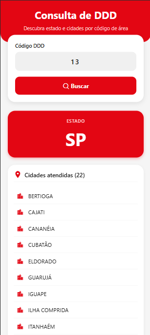

# Consulta DDD - React Native + TypeScript

<h2 align="center">Preview do Projeto</h2>

<p align="center">
  
</p>

Aplicativo mobile para consulta de municípios por código de DDD (Discagem Direta à Distância). Desenvolvido com React Native (Expo) e TypeScript, consumindo a Brasil API. Projeto acadêmico para a disciplina de Programação para Dispositivos Móveis (PDMI).

## Funcionalidades

- Busca por DDD de 2 dígitos (ex: 11, 21, 31, 61)
- Exibição do estado (UF) e lista completa de cidades atendidas
- Listagem das cidades em ordem alfabética (com suporte a acentos)
- Indicador de carregamento durante a requisição
- Tratamento de erros (DDD inválido, falha de rede, API indisponível)
- Layout responsivo e otimizado para navegadores e dispositivos móveis
- Design institucional com as cores da Fatec (vermelho, preto e branco)
- Animações suaves ao carregar resultados
- Ícones vetoriais profissionais

## Tecnologias Utilizadas

- React Native 0.76 (Expo SDK 54)
- TypeScript
- Expo Vector Icons (MaterialIcons, Feather)
- Brasil API (endpoint de DDD)
- React Hooks (useState, useEffect)
- Animated API do React Native

## Como Executar o Projeto

### Pré-requisitos

- Node.js (versão 16 ou superior)
- npm ou yarn
- Expo CLI (instalado globalmente ou via npx)

### Passos

1. Clone o repositório:

git clone https://github.com/Leandro-dsm/react-native-ddd-consulta.git
cd react-native-ddd-consulta

2. Instale as dependências:

npm install

3. Execute o aplicativo:

Para rodar no dispositivo físico com Expo Go:
npx expo start

Para rodar no navegador (recomendado para testes rápidos):
npx expo start --web

Testando a aplicação
Digite um DDD válido de 2 dígitos (ex: 11, 21, 31, 41, 51, 61, 71, 81, 85, 91)

Clique no botão "Buscar"

Aguarde o carregamento e visualize o estado e a lista de cidades em ordem alfabética

Estrutura do Projeto

## Estrutura do Projeto

```text
react-native-ddd-consulta/
├── src/
│   ├── screens/
│   │   └── DddScreen.tsx
│   ├── services/
│   │   └── api.ts
│   ├── components/
│   ├── hooks/
│   ├── styles/
│   └── utils/
├── assets/
├── package.json
└── README.md
```

Observações Técnicas
Gerenciamento de estado: Foram utilizados os hooks useState para controlar o valor do input (ddd), o payload retornado pela API (data) e o estado de carregamento (loading). O hook useEffect é utilizado para limpar o resultado da consulta anterior enquanto o usuário digita um novo DDD.

Consumo de API: A função fetchDDD no arquivo services/api.ts realiza a requisição HTTP para o endpoint https://brasilapi.com.br/api/ddd/v1/{ddd}. Inclui tratamento de erros (404, falha de rede) e timeout.

Tipagem TypeScript: Todas as interfaces estão definidas estritamente (sem uso de any). O retorno da API é tipado como DddResponse contendo state: string e cities: string[].

Ordenação alfabética: A lista de cidades é ordenada utilizando sort() com localeCompare('pt-BR'), garantindo a ordem correta mesmo com acentos.

Design responsivo: O layout utiliza SafeAreaView, ScrollView, FlatList (substituída por map para compatibilidade com web), e StyleSheet. O aplicativo é totalmente funcional em navegador, Android e iOS.

Tratamento de erros: Caso o DDD seja inválido, a API retorne erro ou a rede falhe, uma mensagem amigável é exibida com a opção de tentar novamente.

Animação: Os resultados da consulta e mensagens de erro aparecem com animações de fade e slide, proporcionando uma experiência mais fluida.

API Consumida
Nome: Brasil API

Endpoint: https://brasilapi.com.br/api/ddd/v1/{ddd}

Método: GET

Parâmetro de rota: {ddd} – código DDD de 2 dígitos (ex: 11)

Resposta de sucesso (200):

{
  "state": "SP",
  "cities": ["São Paulo", "Guarulhos", "Campinas", ...]
}

Resposta de erro (404): DDD não encontrado

Documentação oficial: Brasil API - DDD

Considerações sobre a Rede da Faculdade
Se você estiver executando o aplicativo dentro da rede da faculdade (ou outra rede com firewall/proxy), a requisição para a API externa pode falhar (erro "Network request failed"). Nesse caso, recomenda-se:

Testar com dados móveis (4G/5G) no celular físico usando npx expo start --tunnel

Ou utilizar a internet pessoal (hotspot) para desenvolvimento

O código já possui fallback de timeout e tentativas de retry, mas o ideal é uma conexão sem bloqueios.

Autor
Leandro
Estudante de Desenvolvimento de Software Multiplataforma - Fatec
GitHub: Leandro-dsm
